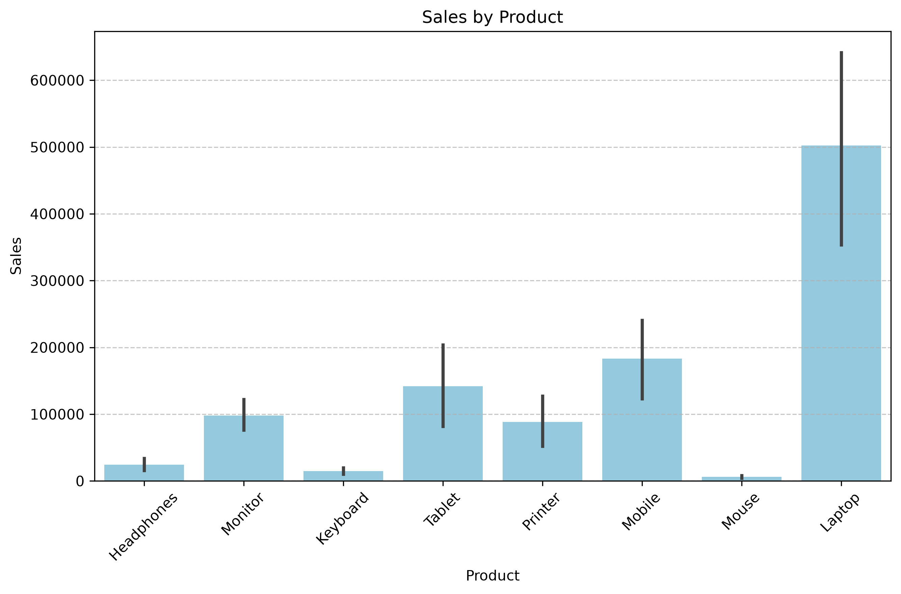
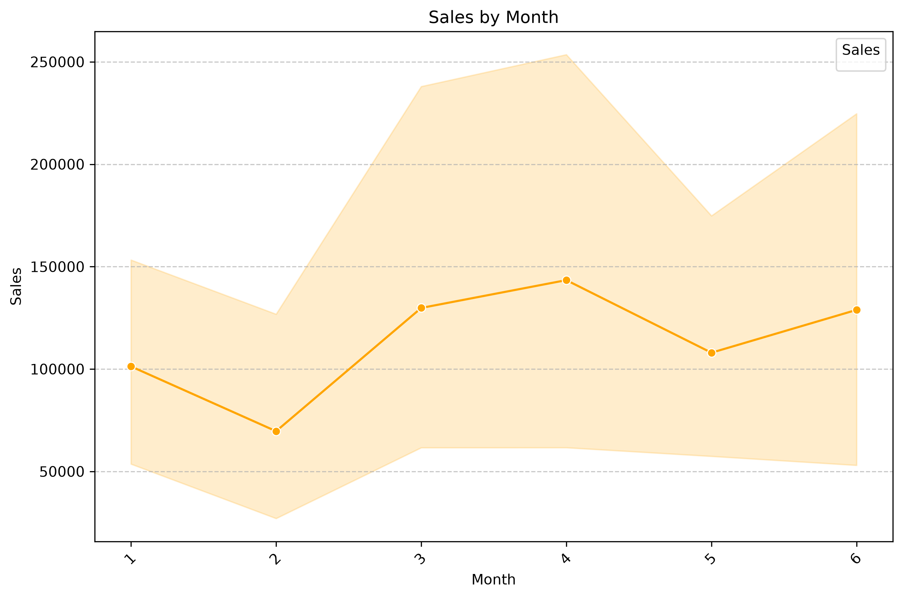
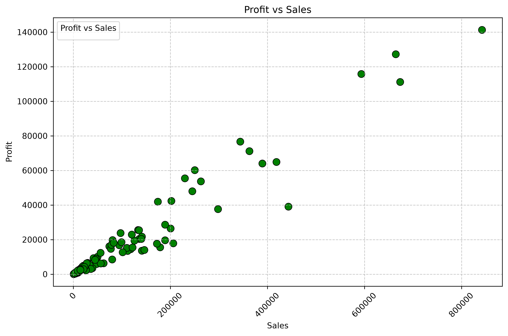
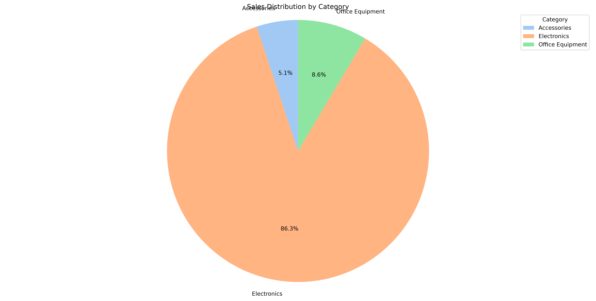

<div align="center">


# 📊 Pandas Analyzer & Data Visualization

### Turn raw sales data into clear, meaningful visual insights 🚀


<br/>


<br/><br/>

**A menu-driven Python project for loading, exploring, analyzing, visualizing, and saving sales data.**

</div>

---

## 🧭 Quick Navigation

- [📌 Project Overview](#-project-overview)
- [🎯 Project Objective](#-project-objective)
- [✨ Key Features](#-key-features)
- [🔄 How the Project Works](#-how-the-project-works)
- [📊 Visualizations](#-visualizations)
- [🖼️ Visualization Gallery](#️-visualization-gallery)
- [🎥 Demo](#-demo)
- [📁 Project Structure](#-project-structure)
- [🧾 Dataset](#-dataset)
- [🛠️ Technologies](#️-technologies)
- [▶️ How to Run](#️-how-to-run)
- [🖥️ Application Menu](#️-application-menu)
- [🧠 Data Analysis Concepts](#-data-analysis-concepts)
- [📚 What I Learned](#-what-i-learned)
- [🚀 Future Improvements](#-future-improvements)
- [👨‍💻 Author](#-author)
- [⭐ Support](#-support)

---

# 📌 Project Overview

**Pandas Analyzer & Data Visualization** is a Python-based data analysis application built to practice real-world data analytics concepts using a sales dataset.

The project provides a simple command-line workflow where a user can:

```text
📂 Load CSV
      ↓
🔍 Explore Data
      ↓
⚙️ Perform DataFrame Operations
      ↓
🧹 Handle Missing Values
      ↓
📊 Generate Statistics
      ↓
📈 Create Visualizations
      ↓
💾 Save Charts
```

The main idea is simple:

> **Raw Data → Analysis → Visualization → Insights**

This project focuses on learning how Python and Pandas can transform structured data into information that is easier to understand.

---

# 🎯 Project Objective

The objective of this project is to build a practical beginner-friendly data analysis workflow instead of only learning Pandas through isolated examples.

### The project demonstrates how to:

- Load data from a CSV file
- Inspect and understand a dataset
- Work with Pandas DataFrames
- Perform common DataFrame operations
- Identify and handle missing values
- Generate descriptive statistics
- Compare numerical values
- Understand relationships between variables
- Visualize data using different chart types
- Save generated visualizations as image files

---

# ✨ Key Features

| Feature | What it does |
|---|---|
| 📂 **Load Dataset** | Loads a CSV dataset into a Pandas DataFrame |
| 🔍 **Explore Data** | Helps inspect columns, records and dataset information |
| ⚙️ **DataFrame Operations** | Performs common operations on the dataset |
| 🧹 **Missing Data Handling** | Identifies and handles missing values |
| 📊 **Descriptive Statistics** | Generates count, mean, std, min, quartiles and max |
| 📈 **Data Visualization** | Creates 6 different visualization types |
| 💾 **Save Visualization** | Saves the current chart as a PNG image |
| 🖥️ **Menu-Driven Interface** | Makes the program easy to use from the terminal |

---

# 🔄 How the Project Works

<div align="center">

### 1️⃣ Load
📄 `sales_data.csv`

⬇️

### 2️⃣ Analyze
🐼 Pandas DataFrame

⬇️

### 3️⃣ Process
🔍 Explore • Filter • Group • Analyze

⬇️

### 4️⃣ Visualize
📊 Bar • Line • Scatter • Pie • Histogram • Stack

⬇️

### 5️⃣ Save
💾 PNG Visualization

</div>

---

# 📊 Visualizations

The application supports **6 visualization types**.

---

## 1️⃣ Bar Chart 📊

### Purpose
A bar chart is useful for comparing values between categories.

### Example
```text
Product → Sales
```

### Questions it can help answer
- Which product has the highest sales?
- Which product has the lowest sales?
- How do different products compare?

### Example Output



---

## 2️⃣ Line Chart 📈

### Purpose
A line chart is useful for observing changes and trends across records.

### Example
```text
SalesID → Sales
```

### Questions it can help answer
- How are sales changing?
- Are there visible increases or decreases?
- What trend can be observed across records?

### Example Output



---

## 3️⃣ Scatter Plot 🔵

### Purpose
A scatter plot helps examine the relationship between two numerical variables.

### Example
```text
Sales → Profit
```

### Questions it can help answer
- Is there a relationship between sales and profit?
- Do higher sales generally correspond to higher profit?
- Are there unusual observations?

### Example Output



---

## 4️⃣ Pie Chart 🥧

### Purpose
A pie chart shows how a total value is divided among categories.

### Example
```text
Category → Sales
```

### Questions it can help answer
- Which category contributes the most sales?
- Which category contributes the least?
- How is sales distributed across categories?

### Example Output



---

## 5️⃣ Histogram 📊

### Purpose
A histogram helps understand the distribution of numerical values.

### Example
```text
Sales → Frequency
```

### Questions it can help answer
- Where are most sales values concentrated?
- How spread out are the values?
- Are there unusually high or low observations?

---

## 6️⃣ Stack Plot 📚

### Purpose
A stack plot helps compare cumulative contributions from multiple groups.

### Example
```text
Month → Sales by Category
```

### Questions it can help answer
- How do categories contribute over time?
- How does cumulative sales change?
- Which category contributes more in different periods?

---

# 🖼️ Visualization Gallery

<div align="center">

### 📊 Sales by Product


<br/><br/>

### 📈 Sales Trend


<br/><br/>

### 🔵 Sales vs Profit


<br/><br/>

### 🥧 Sales by Category


</div>

> 💡 The repository currently includes these generated chart previews. Histogram and stack plot are also supported by the application and can be generated interactively.

---

# 🎥 Demo

<div align="center">

## ▶️ Project Demonstration

Watch the complete project demonstration to see the menu, data analysis workflow, visualization options, and chart saving process.

### 🎬 [Watch the Full Demo Video](YOUR_GOOGLE_DRIVE_VIDEO_LINK_HERE)

</div>

> 🔗 Replace `YOUR_GOOGLE_DRIVE_VIDEO_LINK_HERE` with your Google Drive video link.

---

# 📁 Project Structure

```text
Pandas-Analyzer-Data-Visualization/
│
├── 📁 data/
│   └── sales_data.csv
│
├── 📁 output/
│   ├── sales_bar_chart.png
│   ├── sales_line_chart.png
│   ├── profit_vs_sales_scatter.png
│   └── sales_category_pie.png
│
├── 📁 src/
│   ├── 📁 visualizations/
│   │   └── visualization.py
│   │
│   └── analyzer.py
│
└── README.md
```

### 📌 Main Files

**`src/analyzer.py`**

Contains the main application flow, menu system, dataset analysis operations, and interaction with the visualization module.

**`src/visualizations/visualization.py`**

Contains the visualization logic for generating different chart types.

**`data/sales_data.csv`**

Contains the sales dataset used by the project.

**`output/`**

Stores generated visualization images.

---

# 🧾 Dataset

The project uses a sales dataset containing fields such as:

| Column | Description |
|---|---|
| `SalesID` | Unique sales record identifier |
| `Date` | Date of the transaction |
| `Product` | Product name |
| `Category` | Product category |
| `Region` | Sales region |
| `Sales` | Sales amount |
| `Profit` | Profit generated |
| `Quantity` | Quantity sold |
| `Discount` | Discount applied |
| `Year` | Year of the transaction |
| `Month` | Month of the transaction |

### 🔎 Example Analysis Questions

The dataset can be used to investigate questions such as:

- Which product generates the highest sales?
- Which category contributes the most?
- How are sales distributed?
- What is the relationship between sales and profit?
- How do sales change across records?
- How do categories contribute to monthly sales?

---

# 🛠️ Technologies

<div align="center">

| Technology | Role |
|---|---|
| 🐍 **Python** | Core programming language |
| 🐼 **Pandas** | Data analysis and DataFrame operations |
| 📊 **Matplotlib** | Chart generation |
| 🎨 **Seaborn** | Statistical/data visualization |
| 📄 **CSV** | Dataset format |
| 💻 **VS Code** | Development environment |
| 🐙 **Git & GitHub** | Version control and project hosting |

</div>

---

# ▶️ How to Run

## 1️⃣ Clone the Repository

```bash
git clone https://github.com/PalAnghan/pandas-analyzer-data-visualization.git
```

## 2️⃣ Open the Project

```bash
cd pandas-analyzer-data-visualization
```

Then enter the project folder:

```bash
cd Pandas-Analyzer-Data-Visualization
```

## 3️⃣ Install Dependencies

```bash
pip install pandas matplotlib seaborn
```

## 4️⃣ Run the Application

```bash
python src/analyzer.py
```

---

# 🖥️ Application Menu

When the application starts, it provides a simple menu:

```text
========== Data Analysis & Visualization Program ==========

1. Load Dataset
2. Explore Data
3. Perform DataFrame Operations
4. Handle Missing Data
5. Generate Descriptive Statistics
6. Data Visualization
7. Save Visualization
8. Exit

============================================================
```

### Example Visualization Flow

```text
Enter your choice: 6

========== Data Visualization ==========

1. Bar Plot
2. Line Plot
3. Scatter Plot
4. Pie Chart
5. Histogram
6. Stack Plot
```

The user selects a visualization and provides the required columns.

---

# 📊 Descriptive Statistics

The application can generate common descriptive statistics using Pandas.

Example metrics include:

```text
count
mean
std
min
25%
50%
75%
max
```

These statistics provide a quick overview of the numerical columns in the dataset.

---

# 🧠 Data Analysis Concepts Used

This project combines several important beginner-to-intermediate data analysis concepts.

### 🐼 Pandas

- DataFrames
- CSV reading
- Column selection
- Data filtering
- Grouping
- Pivot tables
- Missing-value handling
- Descriptive statistics

### 📊 Visualization

- Figure creation
- Axis labels
- Titles
- Legends
- Grid
- Rotation
- Chart formatting
- Saving figures

### 🐍 Python Programming

- Classes
- Objects
- Methods
- Functions
- Conditional statements
- Loops
- User input
- Exception handling
- File paths
- Modular code

---

# 🧩 Project Architecture

```text
                  ┌───────────────────┐
                  │   sales_data.csv  │
                  └─────────┬─────────┘
                            │
                            ▼
                  ┌───────────────────┐
                  │   analyzer.py     │
                  │   Main Program    │
                  └─────────┬─────────┘
                            │
             ┌──────────────┼──────────────┐
             ▼              ▼              ▼
       🔍 Explore       📊 Analyze      🧹 Clean
             │              │              │
             └──────────────┼──────────────┘
                            ▼
                  ┌───────────────────┐
                  │ visualization.py  │
                  └─────────┬─────────┘
                            │
             ┌──────────────┼──────────────┐
             ▼              ▼              ▼
          Bar Chart      Line Chart     Scatter Plot
             │
             ├──────────► Pie Chart
             │
             ├──────────► Histogram
             │
             └──────────► Stack Plot
                            │
                            ▼
                  ┌───────────────────┐
                  │   output/*.png    │
                  └───────────────────┘
```

---

# 💡 Why I Built This

I built this project to move from **learning Python concepts individually** to applying them in a complete practical project.

Instead of only practicing:

```text
Pandas
Matplotlib
Python
```

individually, I combined them into one workflow:

```text
Load Data
   ↓
Understand Data
   ↓
Analyze Data
   ↓
Visualize Data
   ↓
Save Results
```

This helped me understand how different Python tools work together in a real data analysis task.

---

# 📚 What I Learned

While building this project, I practiced:

### 🐍 Python

- Object-oriented programming
- Functions and methods
- Conditional logic
- Loops
- User input
- File handling
- Modular programming

### 🐼 Pandas

- Reading CSV files
- Working with DataFrames
- Selecting and filtering data
- Grouping data
- Pivot tables
- Handling missing values
- Descriptive statistics

### 📊 Visualization

- Choosing the right chart for a question
- Comparing categories
- Finding trends
- Understanding distributions
- Exploring relationships between variables
- Saving charts for reporting

### 🧠 Most Important Lesson

> **Good data analysis is not only about creating charts. It is about using the right chart to answer the right question.**

---

# 🚀 Future Improvements

The current project can be extended into a more advanced analytics application.

### Planned Ideas

- 🌐 Interactive web dashboard
- 📊 Plotly interactive charts
- 📁 Excel file support
- 🗄️ Database integration
- 🤖 Machine Learning predictions
- 📈 Advanced sales forecasting
- 🔎 Advanced filtering
- 📤 Automatic PDF/Excel reports
- 🎨 Graphical user interface
- ☁️ Cloud deployment
- 📱 Responsive dashboard
- 🔐 User authentication

---

# 🏆 Project Highlights

<div align="center">

| Area | Implementation |
|---|---|
| 🐍 Programming | Python |
| 🐼 Data Analysis | Pandas |
| 📊 Visualization | Matplotlib + Seaborn |
| 📄 Input | CSV |
| 📈 Charts | 6 types |
| 💾 Output | PNG |
| 🖥️ Interface | CLI / Menu-driven |
| 🧩 Architecture | Modular Python project |

</div>

---

# ⭐ Project Status

<div align="center">

**🟢 Completed — Core Features Implemented**

The project successfully supports:

`Data Loading` → `Analysis` → `Visualization` → `Saving`

</div>

---

# 👨‍💻 Author

<div align="center">

## Pal Anghan

**BCA Graduate • Python & Data Analytics Learner • AI/ML Enthusiast**

<br/>

<a href="YOUR_LINKEDIN_URL_HERE">

</a>

<a href="https://github.com/PalAnghan">

</a>

</div>

---

# ⭐ Support

If you found this project useful or interesting:

⭐ **Star this repository**

🍴 **Fork the repository**

💬 **Share your feedback**

🔗 **Connect with me on LinkedIn**

---

<div align="center">

### 💻 Built with Python, Pandas & Matplotlib

**Analyze → Visualize → Understand → Improve**

<br/>


</div>
